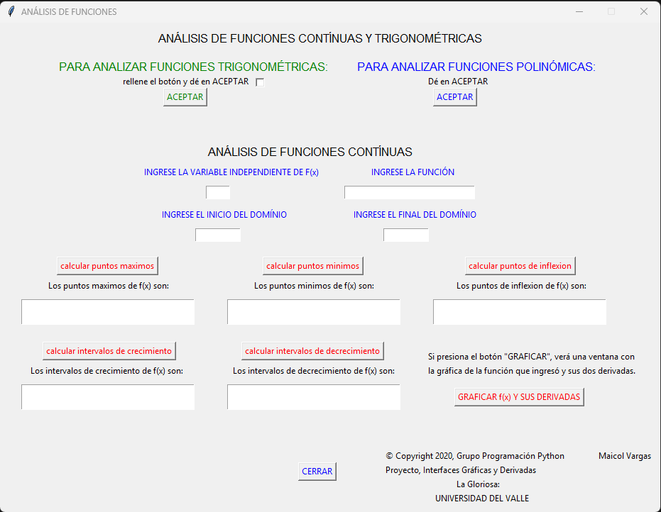
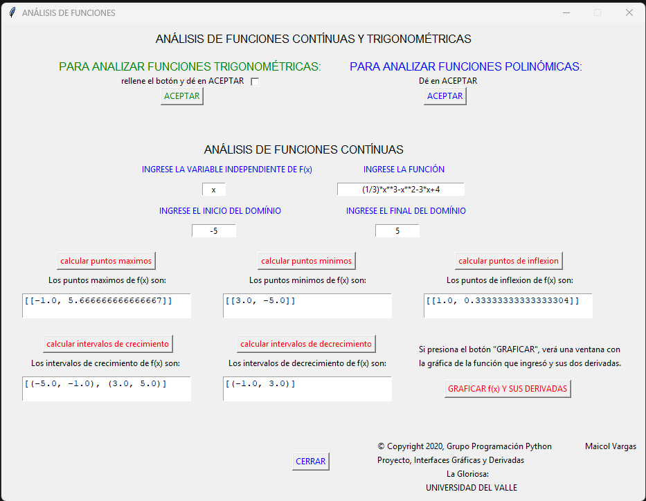
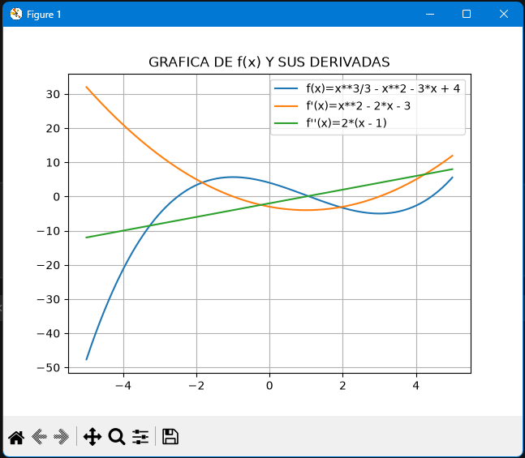

# Analizador de Funciones y sus Derivadas

Aplicación de escritorio en Python que analiza una función real de una variable
usando su primera y segunda derivada: calcula **máximos y mínimos locales**,
**puntos de inflexión** e **intervalos de crecimiento y decrecimiento** dentro
de un dominio que define el usuario, y grafica la función junto a sus dos
derivadas.

El cálculo es **simbólico**, no numérico: las derivadas se obtienen con SymPy y
después se evalúan, así que los resultados son exactos y el programa muestra la
expresión de cada derivada, no solo sus valores.

> Proyecto académico del curso de Programación — Universidad del Valle, 2020.

---

## Capturas

**Interfaz principal — análisis de funciones continuas**



**Resultados sobre `f(x) = (1/3)x³ - x² - 3x + 4` en el dominio [-5, 5]**



Máximo en `x = -1`, mínimo en `x = 3`, punto de inflexión en `x = 1`,
crecimiento en `(-5,-1) ∪ (3,5)` y decrecimiento en `(-1,3)`.

**Gráfica de la función y sus derivadas**



---

## Qué resuelve

Analizar el comportamiento de una función a mano es mecánico y propenso a
errores: derivar, igualar a cero, resolver, evaluar la segunda derivada en cada
punto crítico, comparar signos por intervalos. Este programa automatiza ese
procedimiento completo y muestra el resultado junto a la gráfica, para que el
usuario pueda contrastar lo calculado con lo que ve.

## Funcionalidades

- Derivadas simbólicas de orden *n* de la función que ingresa el usuario.
- Máximos y mínimos locales, a partir de los ceros de la primera derivada
  clasificados con el criterio de la segunda derivada.
- Puntos de inflexión, a partir de los ceros de la segunda derivada.
- Intervalos de crecimiento y decrecimiento, evaluando el signo de la primera
  derivada entre puntos críticos consecutivos.
- Gráfica conjunta de `f(x)`, `f'(x)` y `f''(x)` sobre el dominio elegido.
- Dos modos de análisis: **funciones continuas** (polinómicas, racionales,
  radicales, exponenciales) y **funciones trigonométricas**, con la gráfica de
  estas últimas en unidades de radianes.
- Manual de usuario y ayuda de sintaxis integrados en la interfaz.

## Arquitectura

El proyecto separa el cálculo, la graficación y la interfaz en módulos
independientes:

| Módulo | Responsabilidad |
|---|---|
| `moduloderi_polinc.py` | Cálculo para funciones continuas: derivadas, extremos, inflexión, monotonía |
| `moduloderi_trigo.py` | Lo mismo, adaptado a funciones trigonométricas y sus inversas |
| `modulografi.py` | Graficación de la función y sus derivadas (versión normal y en radianes) |
| `basic_units.py` | Unidades de radianes para los ejes de Matplotlib |
| `usemodulos.py` | Interfaz gráfica en Tkinter y punto de entrada |

Los módulos de cálculo no saben nada de la interfaz: reciben la función, el
dominio y las derivadas ya evaluables, y devuelven listas de resultados. Eso
permite usarlos desde un script sin abrir la ventana.

## Detalles de implementación

- Las expresiones del usuario se interpretan con `sympy.sympify` y se convierten
  a funciones evaluables con `sympy.lambdify`.
- Los puntos críticos salen de `sympy.solve` sobre la primera y segunda derivada.
- Las raíces complejas se descartan intentando convertirlas a `float` dentro de
  un `try/except`: si la conversión falla, el punto no es real y se ignora. Es lo
  que evita que el programa se caiga con funciones cuya derivada no tiene raíces
  reales.
- Todos los resultados se filtran contra el dominio `[a, b]` que definió el
  usuario, de modo que solo se reportan los puntos visibles en la gráfica.
- Para la monotonía se toma un valor de prueba entre cada par de puntos críticos
  consecutivos y se evalúa el signo de `f'` en ese intervalo.

## Requisitos

- Python 3
- `sympy`, `numpy`, `matplotlib`
- `tkinter` (viene con Python en Windows; en Linux se instala aparte)

```bash
pip install sympy numpy matplotlib
```

## Cómo ejecutarlo

```bash
cd PROYECTO
python usemodulos.py
```

Se abre la ventana de análisis de funciones continuas. Para analizar funciones
trigonométricas, marca la casilla de la parte superior izquierda y pulsa
**ACEPTAR**.

### Sintaxis de entrada

| Operación | Se escribe |
|---|---|
| Multiplicación | `*` |
| Potencia | `**` |
| División | `/` |
| Raíz cuadrada | `sqrt(x)` |
| Exponencial | `exp(x)` |
| Pi | `pi` |
| Trigonométricas | `sin(x)`, `cos(x)`, `tan(x)` |
| Inversas | `asin(x)`, `acos(x)`, `atan(x)` |

Ejemplo: `(1/3)*x**3-x**2-3*x+4` con dominio de `-5` a `5`.

## Limitaciones conocidas

Documentadas desde la versión original:

- No interpreta las asíntotas de la función tangente.
- No calcula puntos de inflexión de las inversas de seno y coseno.
- Algunas funciones compuestas no se analizan correctamente.
- La graficación de `tan`, `arcsin` y `arccos` no es fiel cerca de sus
  discontinuidades.

## Autoría

Desarrollo del código: **Maicol Steven Vargas Naranjo**.
Universidad del Valle, 2020.
